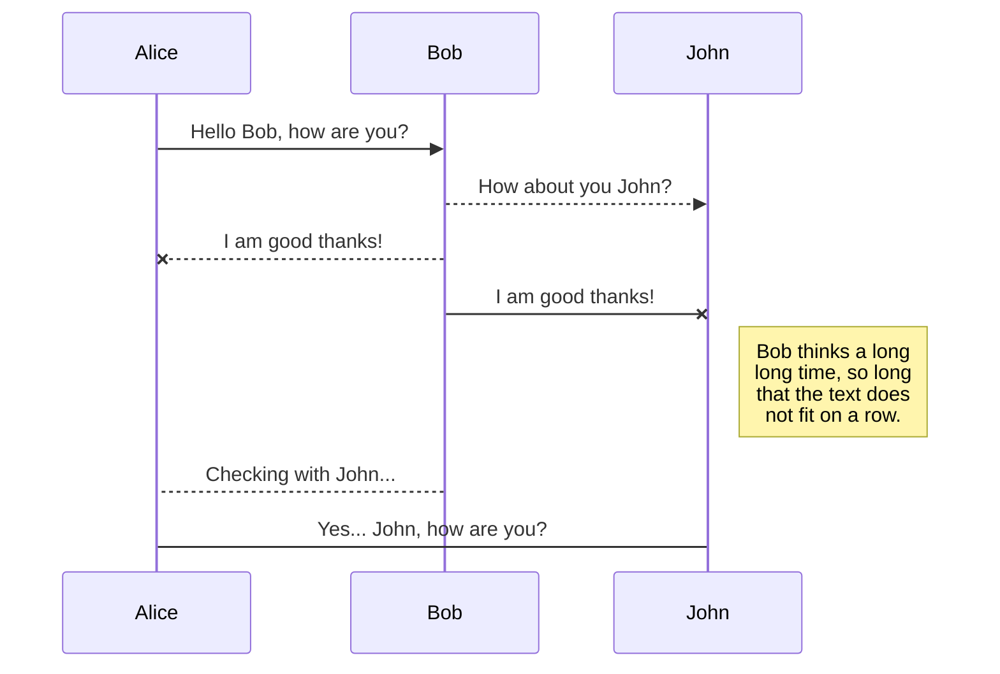
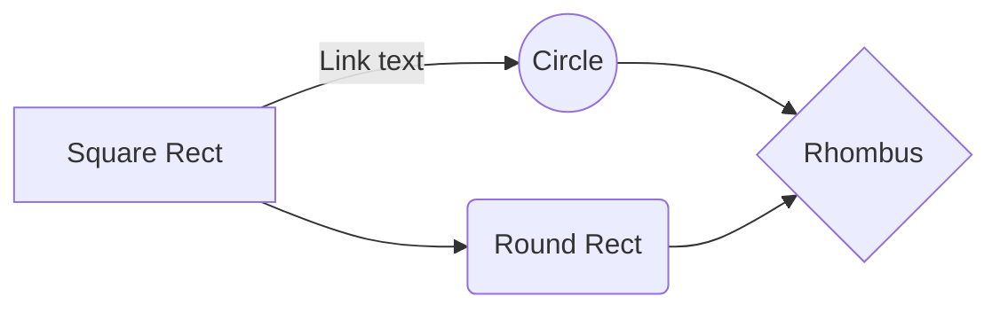

# Spatio Temporal Attention Prediciton

# Introduction

This repository contains code for the re-implementation of the static and dynamic attention prediction models mentioned in the paper 
----- Paper reference -----
It also contains LSTM based models that extend the base model in static and dynamic predictions

## Download

> git clone ----- clone url -----

## Usage

The Orchestrator can is used to orchestrate the interactions with the application.
The Orchestrator accepts two parameters: Service name, port name

Generic example:
>cd Spatio_Temporal_Attention_Prediciton
>python3 Orchhestrator.py (Service Name) (Port Name)

#### Supported services:
1. static : References the base Static Attention Prediction model
2. dynamic : References the base Dynamic Attention Prediction model
3. lstm_static : References the LSTM based Static Attention Prediction model
4. lstm_dynamic: References the LSTM based Dynamic Attention Prediction model
#### Supported ports:
1. dataset : creates the processed data required for training
2. train: Train the model
3. test: Test the model ( generate the prediction image )
4. evaluate: Evaluate the model w.r.t the supported evaluation metrics

Example, to call create dataset for static attention prediction model: 
> python3 Orchhestrator.py static dataset

To train:
> python3 Orchhestrator.py static train

To test:
> python3 Orchhestrator.py static test

To evaluate:
>python3 Orchhestrator.py static evaluate

## Configuration

The configuration file Config.json allows to configure few of the parameters which is used by the application

#### Static parameters:
#### Dynamic parameters
1. TrainedModel : Location of the sav file containing the trained weights
2. FeatureDimension : Dimension of the feature over time. The feature map can be calculated by 
( 2*FeatureDimension + 1)
3. TestTimeIntervalMin: Used while testing, starting time index of the time frame under test . Must be more than FeatureDimension
4. TestTimeIntervalMax: Used while testing, ending time index of the time frame under test . Must be less than max - FeatureDimension
5. TestTimeIntervalStep: Step size of the time frame under test

#### LSTM Static parameters:
#### LSTM Dynamic parameters:

## Export a file

You can export the current file by clicking **Export to disk** in the menu. You can choose to export the file as plain Markdown, as HTML using a Handlebars template or as a PDF.

# Synchronization

Synchronization is one of the biggest features of StackEdit. It enables you to synchronize any file in your workspace with other files stored in your **Google Drive**, your **Dropbox** and your **GitHub** accounts. This allows you to keep writing on other devices, collaborate with people you share the file with, integrate easily into your workflow... The synchronization mechanism takes place every minute in the background, downloading, merging, and uploading file modifications.

There are two types of synchronization and they can complement each other:

- The workspace synchronization will sync all your files, folders and settings automatically. This will allow you to fetch your workspace on any other device.
	> To start syncing your workspace, just sign in with Google in the menu.

- The file synchronization will keep one file of the workspace synced with one or multiple files in **Google Drive**, **Dropbox** or **GitHub**.
	> Before starting to sync files, you must link an account in the **Synchronize** sub-menu.

## Open a file

You can open a file from **Google Drive**, **Dropbox** or **GitHub** by opening the **Synchronize** sub-menu and clicking **Open from**. Once opened in the workspace, any modification in the file will be automatically synced.

## Save a file

You can save any file of the workspace to **Google Drive**, **Dropbox** or **GitHub** by opening the **Synchronize** sub-menu and clicking **Save on**. Even if a file in the workspace is already synced, you can save it to another location. StackEdit can sync one file with multiple locations and accounts.

## Synchronize a file

Once your file is linked to a synchronized location, StackEdit will periodically synchronize it by downloading/uploading any modification. A merge will be performed if necessary and conflicts will be resolved.

If you just have modified your file and you want to force syncing, click the **Synchronize now** button in the navigation bar.

> **Note:** The **Synchronize now** button is disabled if you have no file to synchronize.

## Manage file synchronization

Since one file can be synced with multiple locations, you can list and manage synchronized locations by clicking **File synchronization** in the **Synchronize** sub-menu. This allows you to list and remove synchronized locations that are linked to your file.

# Publication

Publishing in StackEdit makes it simple for you to publish online your files. Once you're happy with a file, you can publish it to different hosting platforms like **Blogger**, **Dropbox**, **Gist**, **GitHub**, **Google Drive**, **WordPress** and **Zendesk**. With [Handlebars templates](http://handlebarsjs.com/), you have full control over what you export.

> Before starting to publish, you must link an account in the **Publish** sub-menu.

## Publish a File

You can publish your file by opening the **Publish** sub-menu and by clicking **Publish to**. For some locations, you can choose between the following formats:

- Markdown: publish the Markdown text on a website that can interpret it (**GitHub** for instance),
- HTML: publish the file converted to HTML via a Handlebars template (on a blog for example).

## Update a publication

After publishing, StackEdit keeps your file linked to that publication which makes it easy for you to re-publish it. Once you have modified your file and you want to update your publication, click on the **Publish now** button in the navigation bar.

> **Note:** The **Publish now** button is disabled if your file has not been published yet.

## Manage file publication

Since one file can be published to multiple locations, you can list and manage publish locations by clicking **File publication** in the **Publish** sub-menu. This allows you to list and remove publication locations that are linked to your file.

# Markdown extensions

StackEdit extends the standard Markdown syntax by adding extra **Markdown extensions**, providing you with some nice features.

> **ProTip:** You can disable any **Markdown extension** in the **File properties** dialog.

## SmartyPants

SmartyPants converts ASCII punctuation characters into "smart" typographic punctuation HTML entities. For example:

|                |ASCII                          |HTML                         |
|----------------|-------------------------------|-----------------------------|
|Single backticks|`'Isn't this fun?'`            |'Isn't this fun?'            |
|Quotes          |`"Isn't this fun?"`            |"Isn't this fun?"            |
|Dashes          |`-- is en-dash, --- is em-dash`|-- is en-dash, --- is em-dash|

## KaTeX

You can render LaTeX mathematical expressions using [KaTeX](https://khan.github.io/KaTeX/):

The *Gamma function* satisfying $\Gamma(n) = (n-1)!\quad\forall n\in\mathbb N$ is via the Euler integral

$$
\Gamma(z) = \int_0^\infty t^{z-1}e^{-t}dt\,.
$$

> You can find more information about **LaTeX** mathematical expressions [here](http://meta.math.stackexchange.com/questions/5020/mathjax-basic-tutorial-and-quick-reference).

## UML diagrams

You can render UML diagrams using [Mermaid](https://mermaidjs.github.io/). For example, this will produce a sequence diagram:

And this will produce a flow chart:

